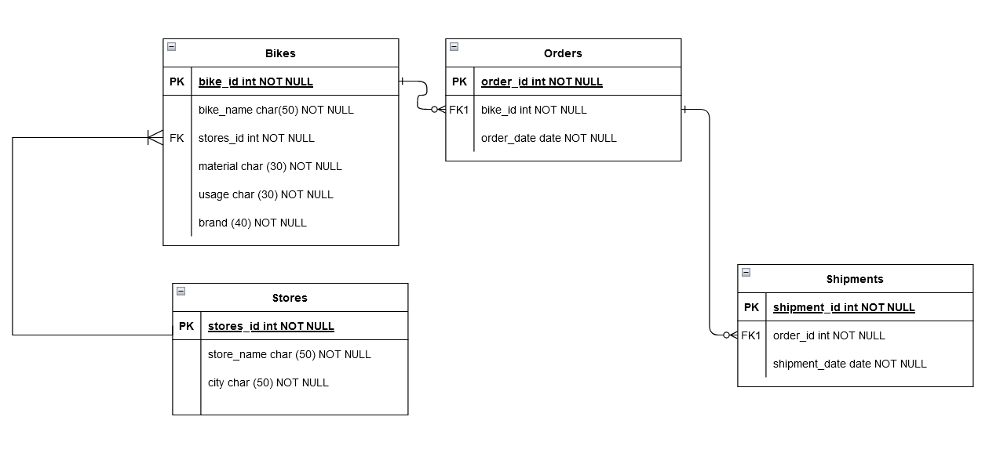

# SQL-Scripts

For this assignment, we had to create different SQL scripts from a relational diagram that we created in a previous assignment: 

### ddl.sql

The first file is `ddl.sql`. In this file we had to create the tables that we can see in the diagram.   

We had to use the keywords:

- `IF NOT EXISTS`
- `PRIMARY KEY`
- `FOREIGN KEY`
- `NOT NULL`
- `CHECK`
- `UNIQUE KEY`
- `AUTO_INCREMENT`

The keyword `CHECK` gave us problems, as MySQL and MariaDB use `ENUM`.

### dml.sql

In the next file we had to put data into the database. The only problem we had here was that the `usage` column in the `bikes` table was a reserved word and we had to put it between "``".

### queries.sql

As the name suggests, we simply had to make a series of queries on our database.

### delete.sql

In this file we must include the scripts to delete the data inside the tables.

### drop.sql

In this file we have the scripts to delete the tables. Something very interesting about this script is that we found a way to delete tables with foreign keys without having to touch anything in the table. `SET FOREIGN_KEY_CHECKS = 0;` it is important that after deleting the tables we want, we activate the check again. `SET FOREIGN_KEY_CHECKS = 1;`

#### 1. We create the database script_database.

#### 2. Now we create the table stores.

#### 3. Next step is to insert data on the table stores.

#### 4. Now we create the table bikes.

#### 5. Next step is to insert data on the table bikes.

#### 6. Here we are gonna combain the creation of the table orders and to insert data on it.

#### 7. Here we are gonna combain the creation of the table shipments and to insert data on it.

#### 8. We are gonna delete all the data from the tables, and then we are going to check if it works

#### 9. We are gonna delete all the tables. For it, first we have to get rid of the FOREIGN-KEYS

#### Queries:

These are the results of the queries:

