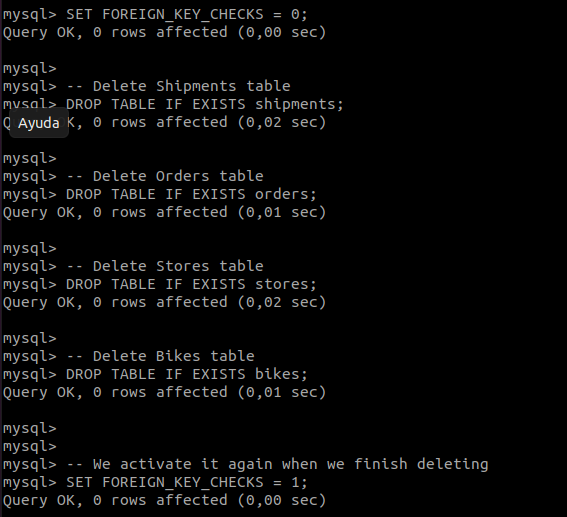

# SQL-Scripts
#### 1. We create the database script_database.

#### 2. Now we create the table stores.

#### 3. Next step is to insert data on the table stores.

#### 4. Now we create the table bikes.

#### 5. Next step is to insert data on the table bikes.

#### 6. Here we are gonna combain the creation of the table orders and to insert data on it.

#### 7. Here we are gonna combain the creation of the table shipments and to insert data on it.

#### 8. We are gonna delete all the data from the tables, and then we are going to check if it works

#### 9. We are gonna delete all the tables. For it, first we have to get rid of the FOREIGN-KEYS

